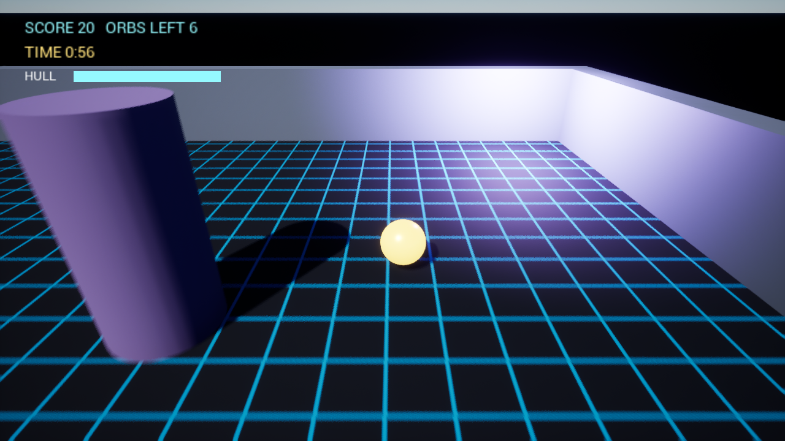

# Shunya Studio AI

A virtual game-development company: AI employees in design, engineering, art, environment, animation, audio, QA, DevOps and documentation develop a **real Unreal Engine project**, and a **2.5D office** shows what each of them is really doing.

Spec: [docs/SPEC.md](docs/SPEC.md). How it maps to the code: [docs/ARCHITECTURE.md](docs/ARCHITECTURE.md). Installing and operating it: [docs/DEPLOYMENT.md](docs/DEPLOYMENT.md). Status of the 40-step plan: [docs/ROADMAP.md](docs/ROADMAP.md).



*Orb Runner, the small 3D game the studio builds: screenshot taken by the QA bot inside the packaged Windows build.*

```
You -> Studio Director -> Producer -> author -> lead review -> build -> QA -> you approve -> merge
```

The author is a programmer (C++, compiled and tested), a designer or writer (documents), or an artist (Unreal assets built in a headless editor). Nobody reviews, tests or merges their own work.

## Run it

Requires Python 3.12+ and Git. Unreal Engine 5.4+ is optional (auto-detected under `C:\Program Files\Epic Games`); without it builds, tests, content and playtests are reported as **SKIPPED**, never as passed.

```powershell
.\scripts\install.ps1            # virtual environment, package, .env, then runs `shunya doctor`
.\.venv\Scripts\shunya serve
```

Open <http://127.0.0.1:8400> and type one of the two requests the scripted agents know:

| Request | What happens | Time with UE 5.8 |
|---|---|---|
| `Create a simple Unreal health component.` | 1 task, 7 employees: plan, C++, a real compile error that gets fixed, tests, review, QA, approval. | about 5 minutes |
| `Build Orb Runner: a small 3D arena game where the player collects glowing orbs while a drone chases them.` | 34 tasks, 31 employees in all nine departments: design documents, six C++ steps, materials, sounds, a level, lighting, a cinematic, a playtest with screenshot, a performance check, a regression run, sign-off, manual, release notes, and a packaged standalone Windows build. | about 50 minutes |

Approve or reject under **Approvals**. For the 34-task run, tick *Auto-approve merges whose computed risk is LOW* there (or set `SHUNYA_AUTO_APPROVE_MAX_RISK=LOW`), otherwise every task waits for your click. The packaged build always waits for you.

Afterwards the game's source is in `workspace/ShunyaGame` on the `develop` branch and the standalone build is in `workspace/builds/v0.1.0/Windows`. Play it (WASD or arrow keys; no Unreal installation needed for this):

```powershell
.\workspace\builds\v0.1.0\Windows\ShunyaGame.exe
```

Other commands - a terminal-only run, the tests (no Unreal or API key needed, about 11 minutes), machine check, backup:

```powershell
.\.venv\Scripts\shunya demo --approve
.\.venv\Scripts\python -m pytest -q
.\.venv\Scripts\shunya doctor
.\.venv\Scripts\shunya backup
```

### Scripted agents vs. real agents

| `SHUNYA_MODEL_PROVIDER` | What runs | Cost |
|---|---|---|
| `scripted` (default) | A fixed screenplay drives the *real* pipeline: real worktrees, compiler, automation tests, headless editor, playtests, reviews and gates. It knows exactly the two requests above and declines anything else. The game's code, documents and asset recipes are part of the script (`shunya/demo/`), not invented at run time. | free |
| `anthropic` | Real Claude agents with the same tools, permissions and budgets, for any request. Needs `ANTHROPIC_API_KEY` (or an `ant auth login` profile). | per token, shown live in the UI |

**Using your API key:** put `ANTHROPIC_API_KEY` in `.env`, or click **Model** in the office and paste it there (it is stored on the server and never sent back). The studio then uses real agents automatically, up to the spending cap shown next to it (`SHUNYA_MAX_SPEND_USD`, default $25). Hosting on a server: see [docs/DEPLOYMENT.md](docs/DEPLOYMENT.md).

Copy `.env.example` to `.env` to configure. Budgets per agent live in `agents/*.yaml` (generated by `tools/dev/gen_agents.py`), per task in `TaskBudget`.

### With Unreal Editor open (optional)

Open `workspace/ShunyaGame/ShunyaGame.uproject` in the editor. The `ShunyaAgentBridge` plugin starts a localhost endpoint (`http://127.0.0.1:30777/shunya`, token in `Config/DefaultEngine.ini`) and the studio's live-editor tools (`get_editor_state`, `find_actor`, `spawn_actor`, `start_pie`, ...) and `/unreal/*` API start working. Compiling, testing, content creation and playtests do **not** need the editor open.

## What is in the box

| Path | What |
|---|---|
| `shunya/core/agent_runtime` | The bounded agent loop: iteration / time / token / cost / tool-call limits, repeated-error detection, pause, cancel, escalation |
| `shunya/core/orchestration` | The status-driven workflow for the three task tracks, planning meetings, approvals with computed risk, report schemas |
| `shunya/core/task_engine` | Task state machine |
| `shunya/core/permissions` | Capability checks and the workspace sandbox (path validation, protected files) |
| `shunya/core/models` | `IModelProvider`, Claude provider, scripted provider, model routing, pricing |
| `shunya/core/persistence`, `events`, `memory.py`, `artifacts.py` | SQL store + append-only event log, event bus (in-memory / Redis), memory kinds, versioned artifacts |
| `shunya/tools` | 41 typed tools: files and documents, git worktrees, C++ index, compile, automation tests, content jobs, playtests, packaging, live-editor bridge. No shell. |
| `shunya/tools/unreal_scripts/apply_content.py` | The one script that runs inside the editor: builds, validates and promotes assets from typed jobs |
| `shunya/knowledge` | C++ symbol index, dependency / call graph, hybrid retrieval |
| `shunya/bridge`, `unreal/ShunyaGame/Plugins/ShunyaAgentBridge` | Unreal Bridge client and the editor plugin |
| `shunya/api`, `apps/studio-ui` | REST + WebSocket API and the 2.5D studio client |
| `shunya/demo` | The two screenplays for the scripted provider, including Orb Runner's code, documents and content recipes |
| `agents/`, `prompts/` | 47 employee definitions (38 active) and layered prompts |
| `unreal/ShunyaGame` | Template of the game project the studio develops |
| `tests/` | State machine, sandbox, runtime limits, the pipelines for both requests, restart recovery, API |
| `shunya/doctor.py`, `logging_setup.py`, `core/processes.py` | Machine preflight, rotating logs, child-process cleanup |
| `docs/` | Architecture, deployment runbook, roadmap, ADRs, the original spec |

Runtime state lives in `data/` (database, artifacts) and `workspace/` (the working game repo and task worktrees); both are git-ignored. Delete them to start from a clean studio.

## Honest status

Verified on the development machine (Windows 10, UE 5.8, Python 3.13):

- **Both scripted requests end to end against the real engine.** The Orb Runner run completed all 34 tasks in 43 minutes: 33 merges approved by the low-risk policy, the packaged build approved by hand.
- **The game it produced.** Six C++ steps each compiled and passed their tests (22 automation tests in total); materials, sounds, the level, lighting and the intro sequence were built by the headless editor; the QA bot won a match (80 of 80, about 58 FPS average on a 2015 Quadro M4000).
- **The standalone build.** Unreal Automation Tool packaged a 898 MB Windows Development build; the packaged executable started on its own and the bot won a match in it.
- The `ShunyaGame` template and both `ShunyaAgentBridge` modules compile on UE 5.8.
- The automated test suite (63 tests, with stand-ins for the engine).

Two defects surfaced only in the real run and were fixed afterwards, outside the pipeline, by an owner commit on the game's `develop` branch plus changes to the template and tools:

- Packaging logs written into the worktree were committed along with the build record. They are now excluded.
- The first packaged build was missing the materials and sounds the game loads by path (the player rendered untextured), because no map references them and the smoke run did not notice. The game folder is now always cooked, the playtest reports missing runtime content, and both the playtest and the packaging checks fail on it. The re-packaged build has no missing content; the screenshot above is from it. That fix has been verified by direct build / test / package runs, not by a second full pipeline run.

Not yet exercised:

- **Real Claude agents.** The provider, the key handling and the spending cap are implemented and tested against stubs, but no paid run was made (no API key on the dev machine). In the scripted runs the employees follow a script; they do not design or code anything themselves. Expect prompt tuning on the first real run.
- **The bridge plugin's HTTP routes against a running editor.** It compiles; the routes have not been called live.
- **Docker Compose / PostgreSQL / Redis.** Written, not run (no Docker on the dev machine). SQLite + in-process bus is what has been tested.
- **Anything beyond one trusted operator.** One shared API token, no users or roles, no TLS; see the last section of [docs/DEPLOYMENT.md](docs/DEPLOYMENT.md).

Nine roles have no real work in a game this small and stay as empty desks: rigging, VFX, landscape, foliage, optimisation, graphics programming, networking, CI, crash investigation. Art and audio are procedural stand-ins (flat-colour materials, a grid texture, synthesised tones), not generated art. The packaged build is Development configuration, not Shipping.
